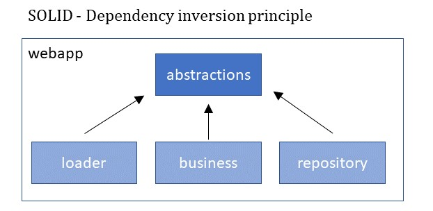

# Movie Card Game #

This project was created as part of a challenge for ADA opportunity.

### Project Modules ###

Principles of SOLID was followed, specially DIP. In this principle SOLID says:
_High-level modules should not import anything from low-level modules. Both should depend on abstractions._ 
So, following this principle, where business should not depend upon repository for example, the structure of this project
is as explained below.

* abstractions
  * Module with all projects abstractions;
  * Following the SOLID fifth concept DIP, to avoid interdependencies between the modules, this module contains all the project's abstractions;
* business
  * Module with all business rules implementations
* repository
  * Module with database layer
* loader
  * Module responsible to load Movies Data from IMDB API
* webapp
  * Module to configure all together and host the API

Currently, this project uses IMDB api to load movies. So, at the very basic layer 
we have Movie bean very similar to IMDB movie model. So, one can think that changing the underlining api (and the Movie bean) would cause
big impact throughout the project. But, as the modules are decoupled, this potential scenario would impact only in
the module that we call `loader`, which is responsible for communicate with IMDB api.
This is the benefit of following the DIP principle properly.

### Authentication ###

In order to not reinvent the wheel, we are using Keycloak as authentication provider.
In real world scenario, usually is used Authentication services from big provider as Cognito or Firebase. 
So, it's important to guarantee that the project follows the standards for security.
This helps to prevent surprises when APIs are deployed to production for the first time. 

If needed, can access http://localhost:8083/ to change configurations or register new users.
The admin credentials is `admin/admin`. The realm used in this project is named as
`movie-card-game`.

### Executing ###

* This project expects Keycloak to be running on port 8083.
* To run it, please use docker-compose.yml placed into the folder `docker`.
  * Use the command: `docker-compose up -f` from inside the folder.
* To run the webapp at port 8081 just run command below (inside `webapp` folder):
  * `mvn spring-boot:run`

### Documentations ###

The documentation is composed with the following folders:

* OpenApi3
  * Contains the OpenAPI 3.0 definition of this API
* Postman
  * Contains the Postman collection of requests. Here you can find a lot of scenarios to test the api. To run it in command line user:
    `newman run MovieCardGameAPI.postman_collection.json`
  * The collection has more than 30 request organized in test case folders.

### Other folders ###

* docker
  * Has the docker configurations files to run Keycloak, with the following configuration:
    * movie-card-game: Custom Realm Created for this project
    * Users:
      * ada-game-user-one (pass: `pass123`)
      * ada-game-user-two (pass: `pass123`)